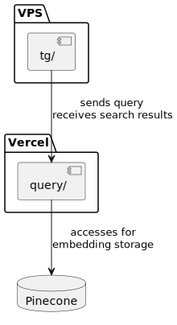

This projects contains code for hybrid search Newlearner Channel with TG bot as front end.

# File

- `Stop_wrods.txt` contains stop words for the search engine. It is used in Jieba when doing full text search
- `texts.txt` contains clean post text from newlearner channel
- `telegram_messages_views.csv` contains raw data from newlearner channel
- semantic_search.py contains code for semantic search using Cohere. It is used for test purpose, not in the production
- `full-text-search.py` contains code for full text search using Jieba. It is used for test purpose, not in the production
- `embed.py` uses `texts.txt`` to genrate embedding with Cohere and Pinecone
- `clean.py` transform `telegram_messages_views.csv` to `texts.txt`
- `query/` contains cloud function code for hybrid query. `query/api/fullTextSearch is no longer used in production since I don't want to handle different modules in Vercel cloud function.
- `tg/` contains code for TG bot

# Server structure

- `query/` is a cloud function deployed on Vercel. It handles the query from TG bot and return hybrid search result
- `tg/` is a TG bot deployed on VPS. It handles user input and send query to `query/` cloud function
- Pinecone is used to store embedding

```PlantUML
@startuml

package "Vercel" {
    [query/] as query
}

package "VPS" {
    [tg/] as tg
}

database Pinecone

tg --> query : sends query\nreceives search results
query --> Pinecone : accesses for\nembedding storage

@enduml

```



# Development

Set the environment varaible first.

You can directly run the python code in query as a python server. But need to change the file path used in `open` in the code.`data/` -> `../data`

You can also directly run the TG bot code by `npm index.js`

# Next

More work need to be done for analytics and feeback loop.

The current hybrid search result looks good. More work need to be done in data pipeline.

When new post is added to the channel, the data pipeline should be triggered to update the embedding and the database for full text search.
